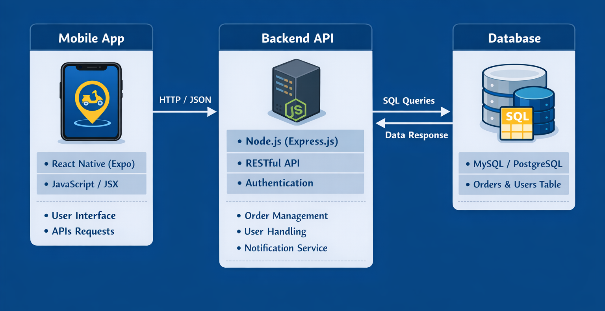

# Last-Mile Delivery Confirmation System

## Overview
A 3-Tier application designed for delivery agents to verify and confirm shipments securely using a unique ID and OTP.
- **Presentation Tier**: React Native (Expo) Mobile App (Styled with **Tailwind CSS**).
- **Application Tier**: Node.js/Express REST API.
- **Data Tier**: MySQL Database.

## Features (New!)
1.  **Agent Authentication**: Secure Register & Login flow with password hashing.
2.  **Dynamic Email OTP**: OTPs are generated on-demand (2-min expiry) and sent via Email.
3.  **Delivery History**: Agents can view their past deliveries in the app.
4.  **Modern UI**: Mobile app refactored to use **Tailwind CSS (`twrnc`)**.

## Architecture



## Setup Instructions

### 1. Database Setup
1.  Ensure MySQL is running.
2.  Run the initialization script:
    ```bash
    mysql -u root -p < database/init.sql
    ```
    This creates the `shipments` and `agents` tables and seeds data.

### 2. Backend Setup
1.  Navigate to `backend/`:
    ```bash
    cd backend
    ```
2.  Install dependencies:
    ```bash
    npm install
    ```
3.  **Configure `.env`**: Create a `.env` file with the following:
    ```env
    PORT=3000
    DB_HOST=localhost
    DB_USER=root
    DB_PASSWORD=your_password
    DB_NAME=last_mile_delivery
    EMAIL_USER=your_email@gmail.com
    EMAIL_PASS=your_16_char_app_password
    ```
4.  Start the server:
    ```bash
    npm start
    ```
    Server runs on `http://localhost:3000`.

### 3. Mobile App Setup
1.  Navigate to `mobile/`:
    ```bash
    cd mobile
    ```
2.  Install dependencies:
    ```bash
    npm install
    ```
3.  Start the app:
    ```bash
    npx expo start
    ```
4.  Scan the QR code with Expo Go or press 'a' for Android Emulator.
    *Note: Ensure `mobile/api/deliveryApi.js` points to `http://10.0.2.2:3000` for Emulator.*

## API Documentation

### Auth
- **POST** `/api/auth/register`: Create a new Agent account.
- **POST** `/api/auth/login`: Authenticate Agent.

### Delivery
- **POST** `/api/delivery/request-otp`: Generate 4-digit OTP & send Email (2-min expiry).
- **POST** `/api/delivery/confirm`: Verify Shipment ID + OTP.
- **GET** `/api/delivery/history/:agentId`: Get delivery history for an agent.

### Demo Video

[Click here to watch the Demo Video](demo_video.mp4)